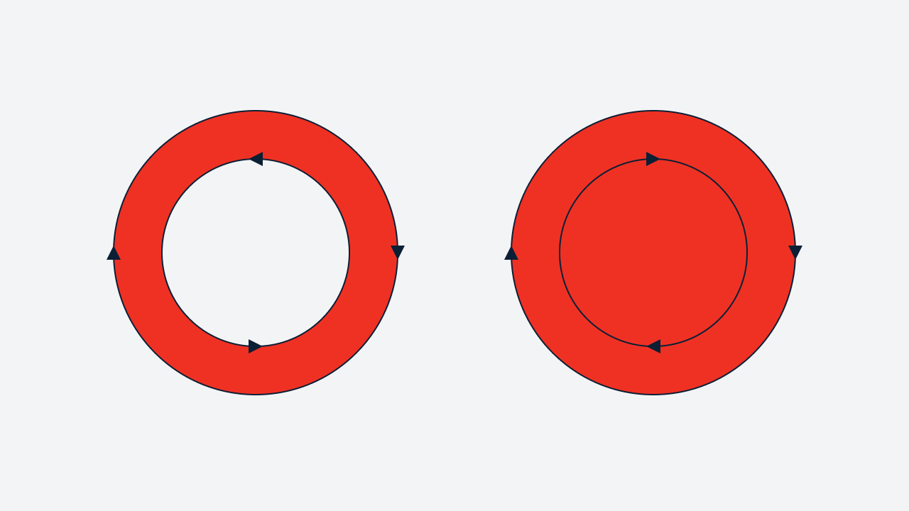
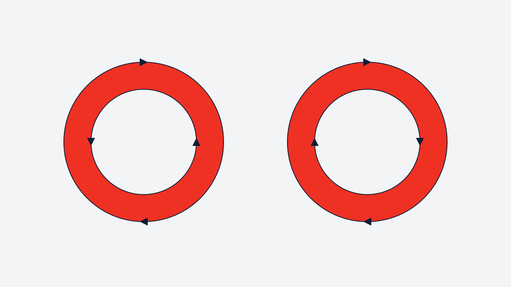
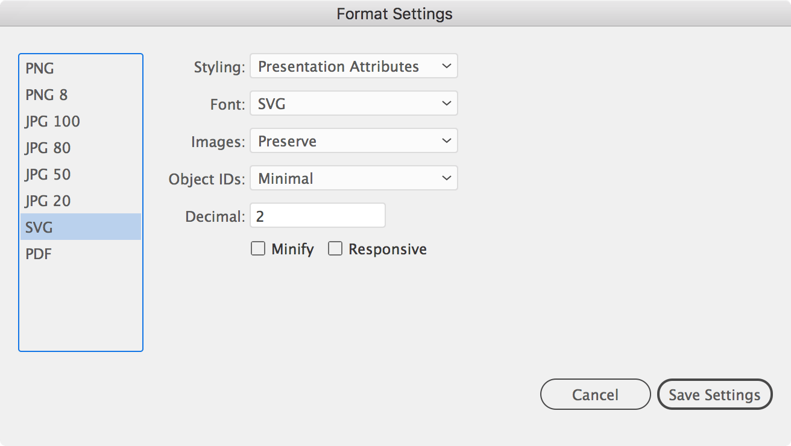

Недавно я намучился с иконкой, которая никак не хотела адекватно конвертироваться на Андройде. В разных размерах она ломалась по-разному, несмотря на то, что строилась по одному принципу.

По горячим следам я составил рецепт, который поможет готовить беспроблемные файлы иконок и  проверять их до загрузки в Git.

Чаще всего проблемы при конвертировании иконок возникают в фигурах с вычитанием. Именно им нужно уделить пристальное внимание.

# Подготовка файла в графическом редакторе

### Избавьтесь от масок, градиентов, растровых изображений и т.п.
Конверторы их не поддерживают

### Переведите обводки в кривые и объедините соприкасающиеся фигуры

### Cбросьте поворот фигур

Конвертор для iOS может проигнорировать фигуры, к которым в коде применяется поворот через трансформацию. Чтобы этого избежать, примените к таким фигурам следующее действие:

В Adobe Illustrator — нажмите сочетание клавиш ⌘+8 либо выберите в меню Object → Compound Path → Make

В Sketch — выберите в меню Layer → Combine → Flatten

### Разбейте на части сложные фигуры с вычитанием

Иногда, чтобы иконка перестала биться, достаточно поменять порядок слоев, но это помогает не всегда. Чтобы не надеятся на авось, лучше разбить фигуры с вычитанием на самостоятельные объекты.

### Проверьте, что в документе используется fill-type: nonzero.

*Nonzero* — правило ненулевого индекса, традиционное для векторных редакторов. Любой контур в векторной графике характеризуется длиной и направлением. Если у простого контура, входящего в состав сложного, изменить направление, то он поменяет свой «вклад в изображение» на противоположный.

Например, если внешний круг нарисован по часовой стрелке, а внутренний в обратном направлении, то центральный круг останется без заливки (слева). Если же оба круга нарисованы в одном направлении — фигура зальется полностью (справа).

☝️ Если в svg-коде не указан fill-type, то nonzero применяется по умолчанию.

*Evenodd* — заливка по правилу четности и нечетности, в котором каждая вторая область является прозрачной. В этом варианте направление контуров не играет роли. К сожалению оно не поддерживается в Android до 7 версии.

В Sketch по умолчанию используется evenodd. Чтобы поменять тип-заливки, выберите нужный вам контур, а затем в панели Fill нажмите на иконку настроек (находится справа от заголовка) и выберите опцию Non-Zero. Чтобы задать противоположное направление контура фигуры, примените к ней Layer → Paths → Reverse Order.

В Adobe Illustrator по умолчанию используется nonzero. Направление контура меняется через меню Object → Path → Reverse Path Direction.

### Сгруппируйте слои с графикой в один

Обычно мы красим иконки в один цвет — белый или темно-синий. Группировка объектов с одинаковыми атрибутами избавит от излишних повторений в коде, потому что цвет будет указан только один раз. 

# Настройка экспорта

### Sketch

Если вы используете Sketch, то подключите плагин [SVGO Compressor](https://sketchapp.com/extensions/plugins/svgo-compressor/). Он убирает из SVG-кода бесполезную информацию: метаданные редактора, комментарии, скрытые элементы, значения по умолчанию, неоптимальные значения и другие элементы, которые не влияют на результат отрисовки SVG.

### Adobe Illustrator

Если вы используете Adobe Illustrator, то поменяйте настройки экспорта на следующие:

# Проверка кода

Gif с эталлонным примером

# Тест иконки

### Android
<http://a-student.github.io/SvgToVectorDrawableConverter.Web/> — 
веб-версия конвертера, который используют наши разработчики. Обратите внимание, что он поддерживает загрузку сразу нескольких файлов.

Чтобы проверить, как будут отображаться сконвертированные иконки, вам понадобится [Android Studio](https://developer.android.com/studio/). После установки создайте новый проект и добавьте *.xml-файлы иконок в папку res/drawable/. Двойной клик по *.xml-файлу, в дереве файлов, покажет превью иконки.

### iOS
Android более требователен к SVG, поэтому если ваша иконка правильно отобразиться на этой ОС, то маловероятно, что с ней будет что-то не так на iOS.

Но, на всякий случай <http://macappstore.org/svg2pdf/> — конвертор который используют наши iOS разработчики. Терминальная команда: svg2pdf  img.svg  img.pdf

### Web
Просто откройте её в любимом браузере
